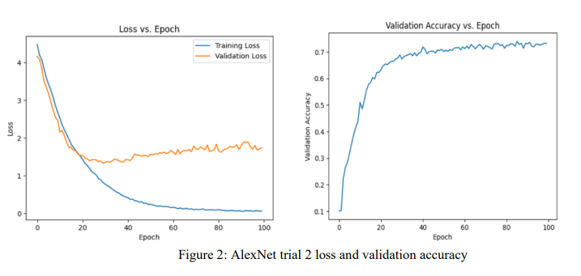
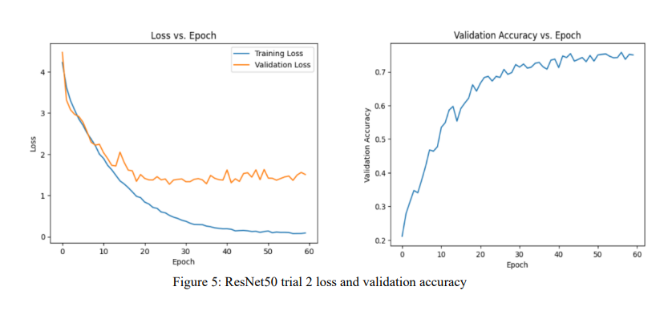
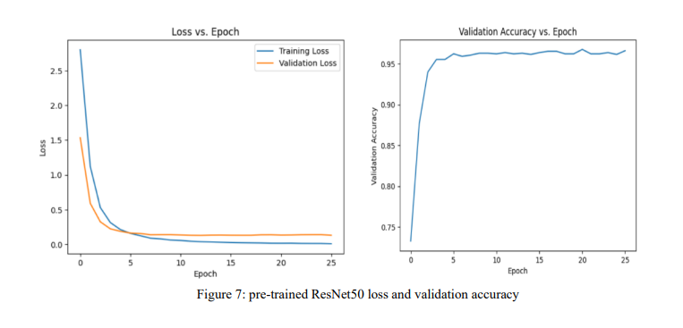

# image-classification

## Overview
This project attempts to identify a suitable implementation of convolutional neural network (CNN) to effectively 
perform image classification on the Caltech101 image dataset. The project examines the performance of two classic 
implementations of CNN: AlexNet and ResNet50. Various attempts to improve model performance are made. The 
models are first trained from scratch with images in the Caltech 101 dataset. Data augmentation and adjustments of 
hyperparameters are implemented as parts of the effort to increase classification performance by increasing training 
data’s diversity and countering overfit. The project first implemented a default AlexNet architecture and attempted to 
improve its performance by adjusting hyperparameter values and enlisting additional data augmentation. ResNet50 is 
then implemented to as a deeper architecture to improve classification performance. Hyperparameter values are again 
adjusted with additional attempts of changing optimization method. Transfer learning is then applied on ResNet50 by 
employing a pre-trained model and fine tune it with the Caltech 101 images to make it suitable for the specific image 
classification problem at hand. As the complexity of the CNN model increases, the classification performance increased, 
while transfer learning with the more complex model achieved the best result for the classification of images in Caltech 
101.

## Data Processing
The Caltech 101 dataset contains 9,144 images of 101 categories. Each category includes around 30 to 800 images. The 
format and size of the images are mixed. RGB and gray-scale images of various sizes are present.   

All images are resized to 244 times 244. Gray-scale images are converted to RGB images to make them compatible with 
the model implementation. Images are normalized according to the ImageNet mean and standard deviation to increase 
the efficiency of training and improve generalization. 
The images are split into three separate sets: training, validation, and testing. The training set contains 70% of the 
images in Caltech101. The models are trained on this set of images. The validation set contains 15% of the images. In 
each training epoch, the model is validated on the validation set of training with the training set as a way to monitor the 
training process in real time. The testing set contains the remaining 15% if images. The testing images are never seen by 
the models during training and serves as the ultimate test for the model’s performance on novel images. 
Basic data augmentation is performed. Random horizontal flip is implemented. About half of the images in the 
training set are randomly flipped horizontally in each batch as the default probability is set 0.5. Images in the training set 
are also randomly cropped after adding 4 pixels of padding at the edges during training, increasing the diversity of the 
training set. The augmentation allows the model to see he same images in different orientations, position, and scale, so 
that it can generalize better for novel images capturing the same object.

## Model Implementation
A classic architecture of AlexNet is implemented. The implementation consists of 5 convolutional layers with the first 
layer having a kernel size of 11 times 11 and the subsequent layers having a kernel size of 3 times 3. A padding of 2 is 
added to the first and second layers while a padding of 1 is added to the subsequent layers. ReLu (Rectified Linear Unit)
is implemented as the activation function. 3 max-pooling are implemented each with a kernel size of 3 and stride of 2 to 
reduce dimension and improve computation efficiency. 3 fully connected layers are employed with the last layer having 
101 nodes, matching the number of image categories of the Caltech 101 dataset. Two drop out layers are incorporated, 
each with a default dropout rate of 0.5 to reduce overfit.    
   
A batch size of 32 is chosen for the model. Cross Entropy Loss function and stochastic gradient decent (SGD)
optimization method are employed for the model. Learning rate is set at 0.001. A momentum of 0.9 is incorporated for 
the SGD method to speed up convergence by considering the both the previous and the current gradient when updating 
the parameters.    
   
A classic architecture of ResNet50 is implemented. There are 50 layers with weights in the model. The initial
convolutional layer has a kernel size of 7 times 7 followed by a max pooling layer with a 3 times 3 kernel. ReLu 
activation function is used, both layers has stride of 3. Four main blocks containing residual units are implemented 
subsequently. Each main block includes several residual units which contains various convolutional layers. Each residual
unit, also referred to as bottleneck blocks, contain 3 convolutional layers with kernel size of 1, 3, and 1 subsequently. The 
input of each residual unit is added to the output before passing to the activation function. ReLu is used for activation 
function and batch normalization is applied after each layer before the activation function to increase training efficiency. 
The first main block has 3 residual units, the subsequent main blocks contain 3, 6, and 3 residual units respectively. A 
global average pooling layer is applied after the main blocks. The final fully connected layer with 101 nodes is then 
applied.    
   
A batch size of 32 is again chosen for the model. Cross Entropy Loss and SGD optimization method are also 
employed again for consistency. Learning rate is set at 0.001 and momentum at 0.9.    
A pre-trained model of ResNet50 is imported from `torchvision`. The final fully connected layer is adjusted to 
have 101 nodes to match the image categories of the Caltech101 dataset. The pre-trained model is already trained on the 
ImageNet images thus the weights are already tuned. The Caltech101 images are passed to the model to fine tune it for 
the specific dataset.   

## Procedure
A total of seven trials are performed. Three trials are for AlexNet, three for ResNet50, and the final trial for pre-trained 
ResNet50. The first trial for AlexNet is training the default implementation from scratch and the results are used as a
performance benchmark for subsequent trails. The second and third AlexNet trials adjusted weight decay and 
incorporated additional data augmentation as attempts to increase the performance of AlexNet. In each trial of AlexNet, 
the model is trained for 100 epochs.    
    
The first trial of ResNet50 is training the default implementation and the results are again used as a benchmark 
for subsequent trials and to compare with AlexNet. The second trail adjusted the optimization method to Adam, an
adaptive learning rate method that dynamically adjust the learning rate during the training process. The initial learning 
rate is 0.001. The third trial reduced the learning rate to 0.001. The first ResNet50 trial trained the model for 100 epochs. 
The second and third trials trained the model for 60 epochs. The final pre-trained ResNet50 trial inherited the default 
hyperparameters of the from the firs ResNet50 trial while. The model is trained for 25 epochs. 

## Results (The best trials)
### AlexNet   
   
### ResNet50   
   
### pre-trianed ResNet50   
   

## Conclution
This project attempted to explore suitable implementations of convolutional neural networks 
for classifying images in the Caltech101 dataset. Two classic architectures, AlexNet and RestNet50 are trained from 
scratch with various adjustments data augmentation and model hyperparameters to improve model performance. The 
Performance of models trained from scratch ranged between 67% to 77% accuracy. Transfer learning is employed for 
ResNet50 and achieved the best result of 97% accuracy. Hyperparameter tuning aiming did not yield significant 
improvement for the models for this project. With more time and resources, it is possible to explore more combinations 
of hyperparameter values that could improve model performance. It appears that increasing model complexity with more 
advanced architecture and applling transfer learning was the most effective strategy to improve model performance in the 
scope of this project.